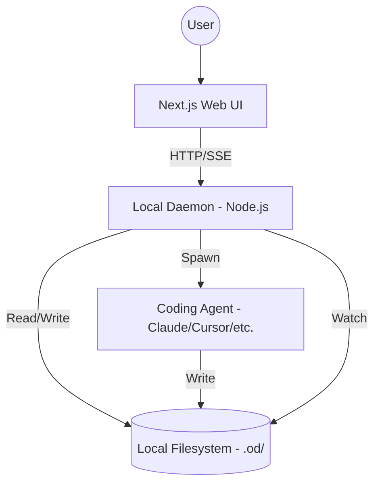
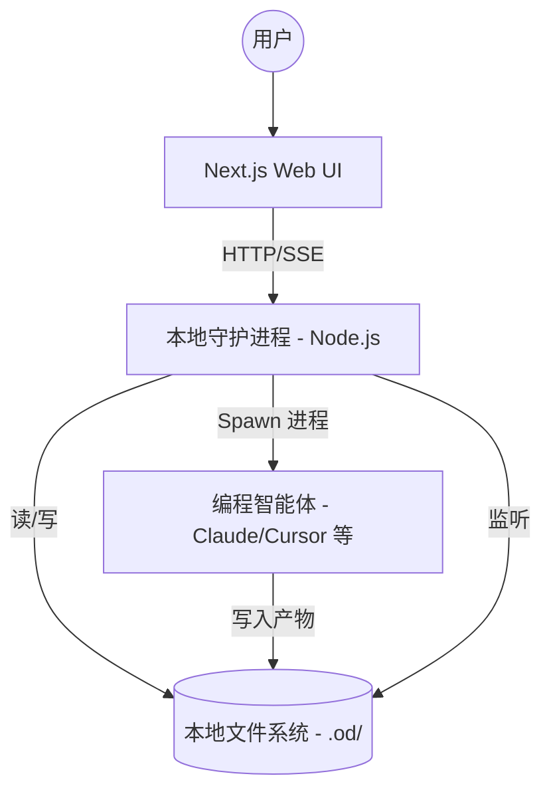

# Open Design Implementation Research Report / Open Design 实现方案调研报告

[English](#english) | [简体中文](#简体中文)

---

## English Research Report

### 1. Overview
Open Design (OD) is a local-first, open-source alternative to Claude Design. It is built as a "Studio" that orchestrates various coding agents (Claude Code, Cursor, etc.) to deliver design artifacts.

### 2. Architecture
Open Design utilizes a **Client-Daemon** architecture:

- **Web Frontend (Next.js 15)**: Provides the UI for chat, artifact preview, and project management.
- **Local Daemon (Node.js/Express)**: A privileged process that manages sessions, detects local agent CLIs, and handles filesystem I/O.
- **Coding Agents**: External CLIs (21+ supported) that act as the execution engine.

#### System Topology

### 3. Core Components

#### 3.1 Design System (`DESIGN.md`)
The "Brand Contract". A standardized 9-section Markdown schema covering colors, typography, and anti-patterns. The daemon parses this to inject brand-grade constraints into every agent run.

#### 3.2 Skills (`SKILL.md`)
Defines the agent's "Taste" and output format (e.g., `web-prototype`, `deck`, `hyperframes`). Skills are standard Markdown files that guide the agent's behavior.

#### 3.3 Agent Adapters
The `apps/daemon/src/runtimes/` directory contains adapters for 21+ CLIs. Each adapter:
- Detects the CLI on `PATH`.
- Builds the CLI command with appropriate flags (e.g., `--input-format stream-json` for Claude Code).
- Parses the agent's output stream into structured events.

### 4. Technical Highlights

- **Sandboxed Preview**: Uses an `<iframe>` with `srcdoc` to isolate artifact code. JSX artifacts are rendered using a vendored Babel standalone and React 18 bootstrap.
  
- **HyperFrames**: An agent-native video framework where the agent writes HTML/CSS/GSAP, which is then rendered to MP4 via headless Chrome and FFmpeg.
- **Local-First Persistence**: Project data is stored in `.od/projects/<id>/` as plain files and SQLite. Artifacts are git-friendly.
- **Surgical Edits**: Users can comment on specific DOM elements (`data-od-id`). The daemon sends the element ID and note to the agent for targeted refactoring.
  

### 5. Product Tour
| Home | Design Systems |
|---|---|
|  |  |

---

## 简体中文调研报告

### 1. 概述
Open Design (OD) 是 Claude Design 的开源、本地优先替代方案。它被定位为一个“工作室 (Studio)”，通过编排各种编程智能体（如 Claude Code, Cursor 等）来交付设计产物（Artifacts）。

### 2. 系统架构
Open Design 采用了 **客户端-守护进程 (Client-Daemon)** 架构：

- **Web 前端 (Next.js 15)**: 提供聊天、产物预览和项目管理的 UI 界面。
- **本地守护进程 (Node.js/Express)**: 一个特权进程，负责管理会话、检测本地 Agent CLI 并处理文件系统 I/O。
- **编程智能体 (Agents)**: 外部 CLI 工具（支持 21 种以上），作为核心执行引擎。

#### 架构拓扑

### 3. 核心概念

#### 3.1 设计系统 (`DESIGN.md`)
“品牌契约”。一个标准的 9 章节 Markdown 模式，涵盖颜色、排版和反模式。Daemon 解析此文件并将其注入 Agent 提示词中，确保输出符合品牌规范。

#### 3.2 技能 (`SKILL.md`)
定义 Agent 的“审美”和输出格式（如网页原型、幻灯片、HyperFrames）。技能是标准的 Markdown 文件，用于引导 Agent 的行为。

#### 3.3 Agent 适配器
`apps/daemon/src/runtimes/` 目录包含了针对 21 种以上 CLI 的适配器。每个适配器负责：
- 在 `PATH` 中检测 CLI。
- 构建带有正确参数的 CLI 命令（例如为 Claude Code 添加 `--input-format stream-json`）。
- 将 Agent 的输出流解析为结构化事件。

### 4. 技术亮点

- **沙箱预览**: 使用带 `srcdoc` 的 `<iframe>` 隔离产物代码。JSX 产物通过内置的 Babel standalone 和 React 18 引导程序进行渲染。
  
- **HyperFrames**: Agent 原生视频框架。Agent 编写 HTML/CSS/GSAP 代码，然后通过无头浏览器 (Headless Chrome) 和 FFmpeg 渲染成 MP4。
- **本地优先存储**: 项目数据以纯文件形式存储在 `.od/projects/<id>/` 中，辅以 SQLite。产物对 Git 友好。
- **局部修改 (Surgical Edits)**: 用户可以针对特定 DOM 元素（通过 `data-od-id`）发表评论。Daemon 会将元素 ID 和说明发送给 Agent，进行精准的代码重构。
  

### 5. 产品展示
| 主页 | 设计系统 |
|---|---|
|  |  |

---

### 6. Data Flow / 数据流

1. **User Input / 用户输入**: Prompt is sent to the Daemon. / 提示词发送至 Daemon。
2. **Context Injection / 上下文注入**: Daemon reads `DESIGN.md` and active `SKILL.md`. / Daemon 读取设计规范和当前技能。
3. **Agent Invocation / Agent 调用**: Daemon spawns the Agent CLI with the prompt + context. / Daemon 启动 Agent CLI 并传入提示词和上下文。
4. **Streaming / 流式输出**: Agent writes files and streams text. Daemon forwards this to the Web UI via SSE. / Agent 写入文件并输出文本。Daemon 通过 SSE 将其转发给 Web UI。
5. **Rendering / 渲染**: Web UI extracts the artifact and updates the sandboxed iframe. / Web UI 提取产物并更新沙箱 iframe。
